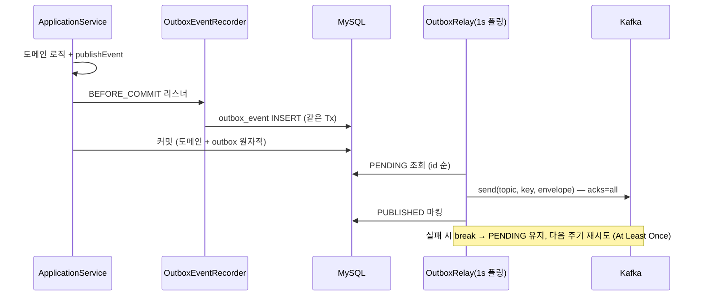

# [Design Doc] 이벤트 파이프라인 설계 — ApplicationEvent에서 Outbox·멱등 Consumer까지 (7주차 · 5팀 · 구혜승)

## TL;DR

하나의 트랜잭션에 묶여 있던 주문·좋아요 흐름에서 **"이 작업이 실패하면 본 트랜잭션도 실패해야 하는가"** 를 기준으로 부가 로직(집계·결제 요청·로깅)을 ApplicationEvent로 분리했다. 서비스 경계를 넘는 이벤트는 **Transactional Outbox**로 DB 커밋과 발행을 원자적으로 묶어 At Least Once를 보장하고, Consumer는 **event_handled 기록과 집계 반영을 한 트랜잭션**으로 묶어 멱등하게 처리했다. 같은 구조를 선착순 쿠폰 발급에 적용해 **100장 한정 + 300명 동시 요청에서 초과 발급 0건**을 검증했다. 부수 성과로, 이벤트 분리가 기존 `removeLike`의 DELETE 유실 버그를 구조적으로 해결했다.

---

## 본문

### Introduction & Goals

**Context / Background**
- 기존 주문 생성은 재고 차감·쿠폰 사용·주문 저장을 한 트랜잭션에서 처리하고, 좋아요는 like_count 갱신까지 동기로 수행했다.
- 이 구조는 PG 지연이 주문을 느리게 만들고, 집계 코드의 실패가 좋아요를 롤백시키는 **실패 전파** 문제를 갖는다.
- 이번 주 목표는 트랜잭션 경계를 재설계하고, 이벤트를 Kafka로 외부화해 별도 Consumer 앱(commerce-streamer)이 후속 처리를 담당하는 구조로 확장하는 것.

**Goals**
- 핵심 트랜잭션(주문 성립 조건)과 후속 처리(집계·결제 요청·로깅)를 분리한다.
- DB 커밋과 Kafka 발행 사이의 원자성 문제(dual write)를 해결해 **이벤트를 잃지 않는다**.
- At Least Once로 인한 중복 수신에도 **결과는 정확히 1회만 반영**한다.
- 선착순 쿠폰에서 수량 초과 발급이 물리적으로 불가능한 구조를 만든다.

### Key Decisions

#### 1. 무엇을 이벤트로 분리하는가 — 판단 기준표

"무조건 분리"가 아니라 트랜잭션 결과와의 상관관계로 판단했다.

| 작업 | 주문/좋아요와 운명 공유? | 결정 |
|---|---|---|
| 재고 차감, 쿠폰 사용 | 예 — 주문 성립의 필수 조건 | 트랜잭션 유지 |
| 결제 요청(PG) | 아니오 — PG가 죽어도 주문은 저장돼야 복구 가능 | `AFTER_COMMIT` + `@Async` |
| like_count 집계 | 아니오 — 집계가 늦어도 좋아요는 성공 | `AFTER_COMMIT` + `@Async` |
| 유저 행동 로깅 | 아니오 — 커밋 여부와도 무관("시도"를 기록) | 순수 `@EventListener` + `@Async` |
| outbox 기록 | **같은 트랜잭션이어야 함** — 롤백 시 함께 사라져야 | `BEFORE_COMMIT` |

같은 이벤트 발행 코드라도 **커밋과의 관계는 전부 수신 측이 결정**한다. 발행자는 후속 처리의 존재를 모른다.

#### 2. Dual Write → Transactional Outbox

DB 커밋과 Kafka 발행은 서로 다른 시스템이라 어떤 순서로 해도 한쪽만 성공하는 순간이 온다(커밋 후 발행 실패 → 이벤트 유실 / 발행 후 롤백 → 유령 이벤트). 해법은 **두 번 쓰지 않는 것**: 이벤트도 DB(outbox 테이블)에 쓰면 도메인 변경과 한 트랜잭션으로 묶인다.



- **릴레이가 실패 시 뒤 이벤트도 중단(break)** 하는 이유: 같은 파티션 키의 순서를 지키기 위해. 뒤 이벤트를 먼저 보내면 "생성 → 취소" 순서가 뒤집힐 수 있다.
- envelope은 `{eventId, eventType, aggregateId, occurredAt, payload}`로 **명시적으로 조립**한다. 내부 이벤트 객체를 그대로 직렬화하지 않아서, `OrderCreatedEvent`의 카드번호 같은 민감 정보가 경계 밖으로 나가지 않는다(내부 모델 ≠ 외부 계약).

#### 3. Idempotent Consumer — 왜 "한 트랜잭션"인가

Consumer(commerce-streamer)는 `event_handled(event_id unique)` 기록과 `product_metrics` upsert를 **한 트랜잭션**으로 묶는다.

- 커밋 **전** 장애 → 둘 다 롤백 → ack 안 됨 → 재수신 시 처음부터 재처리 (**유실 없음**)
- 커밋 **후** ack 전 장애 → 재수신 시 event_handled에 존재 → 스킵 (**중복 없음**)

둘을 다른 트랜잭션으로 나누면 "마킹만 커밋되고 집계 전에 죽는" 경우 영구 유실이 생긴다. *"왜 이벤트 핸들링 테이블과 로그 테이블을 분리할까?"* 에 대한 내 답: **소유자와 책임이 다르다.** outbox는 Producer의 "보낼 것 목록"(전체 이력, 재발행), event_handled는 Consumer의 "처리한 것 목록"(PK 존재 여부만 중요한 빠른 멱등 판정). 합치면 양쪽 앱이 한 테이블에 다른 목적으로 의존하게 된다.

#### 4. 선착순 쿠폰 — 동시성 문제를 직렬화로 바꾼다

```
POST /coupons/{id}/issue-requests → 한 Tx(요청 레코드 PENDING + outbox) → 202 + requestId
  → coupon-issue-requests (key=couponTemplateId)
  → Consumer: 멱등 체크 → 중복 발급 확인 → 원자적 수량 차감 → 발급 → 요청 확정
GET /coupons/issue-requests/{requestId} → polling으로 SUCCESS/FAILED 확인
```

동시성 방어는 2중이다.
1. **파티션 직렬화**: key=templateId라 같은 쿠폰의 요청은 한 파티션에서 순차 처리 — 애초에 경합이 없다.
2. **원자적 UPDATE**: `UPDATE coupon_templates SET issued_quantity = issued_quantity + 1 WHERE id = ? AND issued_quantity < total_quantity` — 리밸런싱 직후처럼 만에 하나 겹쳐도 DB가 최종 방어선.

멱등 키는 별도 UUID 대신 **requestId를 envelope의 eventId로 재사용**했다. "이 요청을 처리했는가"가 자연스러운 멱등 단위이기 때문이다. 검증: 100장 한정 + 300명 요청 통합 테스트에서 SUCCESS 정확히 100, FAILED 200, `issued_quantity` = 100.

### Trade-offs & Constraints

- **조회 경로의 outbox INSERT**: 상품 조회 이벤트(PRODUCT_VIEWED)도 outbox를 경유하므로 읽기 경로에 INSERT 1건이 추가된다. 조회수 유실 허용 + 직접 발행이라는 대안이 있었지만, 파이프라인 일관성을 우선했다.
- **릴레이 폴링 지연**: 발행까지 최대 1초(폴링 주기)의 지연이 있다. 선착순 쿠폰도 outbox를 경유하므로 응답은 즉시지만 처리 시작은 1초 내외 늦어진다 — "빠른 접수, 약간 늦은 처리"를 수용했다.
- **poison message는 스킵**: 해석 불가 메시지는 로그 후 건너뛴다. DLQ는 이번 범위에서 제외(Nice-to-have)했으므로, 반복 실패 격리는 다음 과제.
- **apps 간 코드 공유 금지**: streamer가 commerce-api의 엔티티를 import할 수 없어, 같은 테이블(coupon_templates 등)을 바라보는 **Consumer 관점의 축소 매핑 엔티티**를 자체 정의했다. 스키마를 공유하는 두 앱의 결합은 남는다 — 컬럼 변경 시 양쪽을 함께 손봐야 한다.

### Troubleshooting Notes

1. **이벤트 분리가 고친 기존 버그**: `removeLike`는 derived delete(커밋까지 지연)와 벌크 UPDATE(`@Modifying(clearAutomatically=true)`)가 한 트랜잭션에 있었는데, clear가 큐에 대기 중이던 DELETE를 버려 **like 행이 지워지지 않고 count만 줄고 있었다**. INSERT는 IDENTITY 전략이라 즉시 실행돼 addLike는 무사했던 비대칭이 원인 파악의 단서. 분리 후 두 작업이 다른 트랜잭션이 되며 자연 해결됐다.
2. **kafka.yml `value-serializer` 오타**: consumer 설정 키 오타를 Spring이 조용히 무시해 역직렬화기가 미등록 → 컨슈머가 기동 불가였다. yml은 "적용됐다고 믿지 말고 확인".
3. **`auto.offset.reset=latest`는 신규 그룹의 과거를 버린다**: 집계 컨슈머는 earliest로 변경. 이 설정은 "그룹의 첫 시작"에만 작동한다는 걸 체감.
4. **Awaitility `untilAsserted`는 AssertionError만 재시도**: `orElseThrow()`의 NoSuchElementException은 즉시 전파돼 비동기 테스트가 첫 폴링에 죽는다. `hasValueSatisfying` 같은 단언 기반으로 작성해야 한다.

### Result

- Step 1~3 필수 체크리스트 전부 구현·테스트 통과 (커밋: fdb0188 → 3e6411a, 6개)
- 핵심 검증: 집계 실패 격리 / 롤백 시 outbox 미기록 / 중복 수신 1회 반영 / 선착순 초과 발급 0건
- 다음 과제: DLQ 구성, Consumer Group 관심사 분리, 그리고 이 구조 위에 올릴 주문 대기열 시스템
